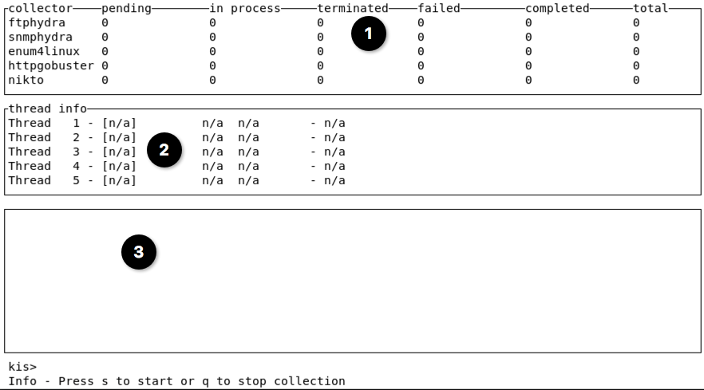

# kiscollect

This script implements a commandline interface to collect intelligence. The collection is performed by so called
collectors.

A collector is a Python module, which can operate on the IP address (e.g., collector shodanhost), IP network
(e.g., collector tcpnmap), service (e.g., collector ftphydra), second-level domain (e.g., collector theharvester)
or company level (e.g., collector crtshcompany). The collectors create these commands based on the data that is 
available in the KIS database and after each execution, they perform the following tasks:

  * Analyse the OS command's output.
  * Report any potential valuable information to the user.
  * Enrich the data (e.g., newly identified IPv4 addresses, host names, URLs, credentials, etc.) in the database to
  ensure that subsequent collectors can re-use it.

Collectors are executed in a specific order to ensure that information required by one collector (e.g., httpeyewitness)
is already collected by another (e.g., httpgobuster).

Note that service-level collectors identify services from which they can collect intelligence by comparing the protocol
(TCP or UDP) and port number or by the Nmap service name. The Nmap service name is useful, if services are running on
non-standard ports. At the moment, only the service names of Nmap and partially Tenable Nessus are supported, which 
means that only from Nmap scan results KIS is able to collect intel from services running on non-standard ports.

If kiscollect is started, then the user is presented with a user interface like the following:

The user interface is divided into the following three sections:

  1. **Collector list**: Provides an overview of the collection status per collector. The numbers tell how
  many Kali commands are pending, failed, or succeeded. The order of the collectors in this list is also the order of
  execution.
  2. **Thread info**: Shows which thread runs which collector on which host, service, or domain for how long. Note
  that only the Kali commands of one collector are executed at a time and all Kali commands of the collector must be
  finished before continuing the execution of Kali commands of the next collector. Why? Subsequent collectors might depend
  on the information identified by the current collector. In addition, you might see several threads working on the same
  service. That's intended as one collector can create several commands, which are then executed by different threads in
  parallel.
  3. **Report items**: If a collector finds interesting information (e.g., credentials), then this information is shown
  in this area. This allows the immediate analysis of the identified information. In addition, this information is 
  also logged in log file `/opt/kaliintelsuite/kis/kaliintelsuite.log`. Note that this section is not scrollable. If 
  you want to access the data, then open the log file `/opt/kaliintelsuite/kis/kaliintelsuite.log`.

You can interact with kiscollect using the following commands. Each command is executed after you hit the enter key.

  * **s** starts the collection
  * **k** followed by the thread ID shown in the **Thread info** section, will kill the thread. `k1` will for example
  kill the first thread in the **Thread info** section.
  * **t** followed by the thread ID shown in the **Thread info** section, will terminate the thread. `t5` will for
  example terminate the fifth thread in the **Thread info** section.
  * **n** terminates all commands of the current collector and continues with the commands of the next collector.
  * **q** terminates all commands and quits the application.

If you add argument `-S` (show) to any kiscollect command, then KIS just prints the created OS commands. This helps in
  * gaining a better understanding of what the commands are actually doing or
  * executing a single command manually for testing purposes.

Per default, when KIS is restarted, it does not execute any OS commands that have already been executed. If you want
to force re-execution, then you have to add argument `--restart` followed by the execution status (e.g., `failed`) that 
shall be repeated.

**Note 1**: Make sure that the terminal where you start this command is in full screen mode and do not resize it 
during the execution.

**Note 2**: Do not start more than one process of kiscollect in parallel as kiscollect performs a cleanup during
the startup phase. Thereby, it deletes all commands whose execution status is pending. Consequently, the
kiscollect process that was started first, won't be able to find its commands anymore. As a result, you will find a
lot of exceptions in the `/opt/kaliintelsuite/kis/kaliintelsuite.log` file.
