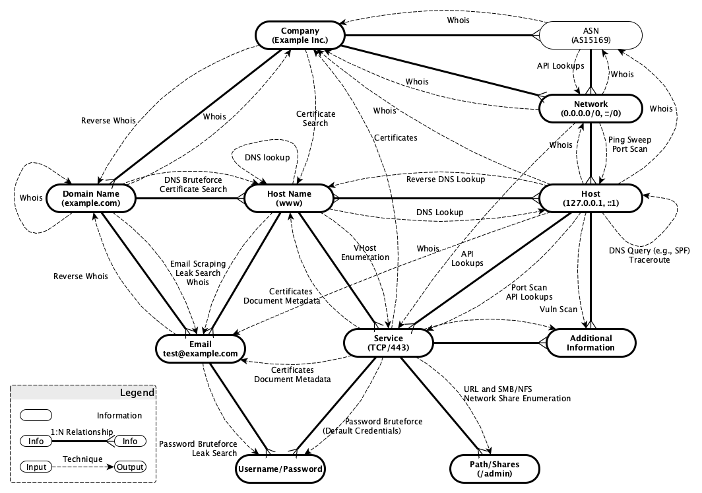

# Kali Intelligence Suite

Kali Intelligence Suite (KIS) shall aid in the fast, autonomous, central, and comprehensive collection of intelligence 
by automatically:

 -  executing Kali Linux tools (e.g., dnsrecon, gobuster, hydra, nmap, etc.)
 -  querying publicly available APIs (e.g., Censys.io, Haveibeenpwned.com, Hunter.io, Securitytrails.com,
 DNSdumpster.com, Shodan.io, etc.)
 -  storing the collected data in a central rational database (see next section)
 -  providing an interface to query and analyze the gathered intelligence

After the execution of each Kali Linux tool or querying APIs, KIS analyses the collected information and extracts
as well as reports interesting information like newly identified user credentials, hosts/domains, TCP/UDP services,
HTTP directories, etc. The extracted information is then internally stored in different PostgreSql database tables,
which enables the continuous, structured enhancement and re-use of the collected intelligence by subsequently
executed Kali Linux tools.

Additional features are:

 -  pre-defined dependencies between Kali Linux tools ensure that relevant information like SNMP default community
  strings or default credentials is known to KIS before trying to access the respective services

 -  remembering the execution status of each Kali Linux tool and API query ensures that already executed OS commands
  are not automatically executed again

 -  data imports of scan results of external scanners like Masscan, Nessus, or Nmap

 -  supporting the intelligence collection based on virtual hosts (vhost)

 -  using a modular approach that allows the fast integration of new Kali Linux tools

 -  parallel Kali Linux command execution by using a specifiable number of threads

 -  enables users to kill Kali commands via the KIS user interface in case they take too long

 -  access public APIs to enhance data with OSINT

## Setup and Installation

Refer to [INSTALL](INSTALL.md) for more information.

## KIS' Data and Collection Model

The following figure illustrates KIS' data and collection model. Thereby, each node represents a table in the rational 
database and each solid line between the nodes documents the corresponding relationship. The dashed directed graphs 
document based on which already collected intelligence (source node) KIS is able to collect further information 
(destination node). The labels of the directed graphs document the techniques used by KIS to perform the collection.



## Scoping the Engagement
Scoping is an essential feature of KIS, which specifies on which IP networks, IP addresses, host names, etc.,  
KIS is allowed to collect data (e.g., via OSINT or active scans) from. Before diving into scoping, it is important to 
understand the following collection types, which are supported by KIS:

 -  **Passive**: Passive collections do not directly interact with the targets but obtain the information from
 third-party sources like whois. Per default, KIS automatically executes these collections and, thereby, no scoping is 
 required.
 -  **Active**: Active collections directly interact with the targets by for example actively scanning them. Thus, in
 contrast to passive collections, these type of collection requires permission from the target's owner and, therefore,
 KIS does not automatically perform active collections unless the targets are explicitly marked as in scope.
 -  **Active***: Active* collections are actually passive collections. Nevertheless, as accessing some third-party
 sources is somehow limited (e.g., querying certain sources like Shodan.io cost credits), they are treated like active 
 collectors, and, as a result, targets must be marked as in scope in order to perform active* collections on them.

Scopes can be set on the following items by using the script `kismanage`:

 - **IP networks** and **IP addresses**: For IP networks the following scope types can be set:
    * `all`: Sets the given IP network (e.g., 192.168.1.0/24) together with all IP addresses (e.g., 192.168.1.1) that 
    are within this network range in scope. As a result, KIS automatically executes any active and active* collectors 
    on such IP networks and IP addresses.
    
      This scope type is useful during penetration tests where the scope is limited to certain IP networks and all 
    their IP addresses.
    
      The following listing provides an example on how this scope type is set during the initial intel collection setup:
      ```bash
      # create a new workspace example
      $ sudo docker-compose run kaliintelsuite kismanage workspace -a example
      # add the network 192.168.1.0/24 to workspace example and set the scope to all (default)
      $ sudo docker-compose run kaliintelsuite kismanage network -w example -a 192.168.1.0/24
      # add new IP address 192.168.1.1 to workspace example. IP address is automatically in scope due to the network's scope all
      $ sudo docker-compose run kaliintelsuite kismanage host -w example -a 192.168.1.1
      # verify the initial setup
      $ sudo docker-compose run kaliintelsuite kisreport host -w example --csv | csvcut -c "Network (NW)","Scope (NW)","IP Address (IP)","In Scope (IP)" | csvlook
      | Network (NW)   | Scope (NW)    | IP Address (IP) | "In Scope (IP)" |
      | -------------- | ------------- | --------------- | --------------- |
      | 192.168.1.0/24 | all           | 192.168.1.1     |            True |
      ```
    * `strict`: Sets the given IP networks' (e.g., 192.168.1.0/24) scope to `strict`. In contrast to type `all`, the
    network itself is not in scope and IP addresses within this network range (e.g., 192.168.1.1) are not automatically 
    in scope, unless they are explicitly added. As a result, KIS only automatically executes any active or active* 
    collectors on IP addresses that are explicitly added to the scope.
    
      This scope type is useful during penetration tests where the scope is limited to certain IP addresses within a 
    given network.
    
      The following listing provides an example on how this scope type is set during the initial intel collection setup:
      ```bash
      # create a new workspace example
      $ sudo docker-compose run kaliintelsuite kismanage workspace -a example
      # add the network 192.168.1.0/24 to workspace example and set the scope to strict
      $ sudo docker-compose run kaliintelsuite kismanage network -w example -a 192.168.1.0/24 -s strict
      # add new IP address 192.168.1.1 to workspace example and set it in scope (default)
      $ sudo docker-compose run kaliintelsuite kismanage host -w example -a 192.168.1.1
      # verify the initial setup
      $ sudo docker-compose run kaliintelsuite kisreport host -w example --csv | csvcut -c "Network (NW)","Scope (NW)","IP Address (IP)","In Scope (IP)" | csvlook
      | Network (NW)   | Scope (NW)    | IP Address (IP) | "In Scope (IP)" |
      | -------------- | ------------- | --------------- | --------------- |
      | 192.168.1.0/24 | strict        | 192.168.1.1     |            True |
      ```
    * `exclude`: Sets the given IP network (e.g., 192.168.1.0/24) together with all IP addresses (e.g., 192.168.1.1) 
    that are within this network range out of scope. As a result, KIS does not execute any active and active* 
    collectors on this IP network and its IP addresses.
    
      This scope type is the default type for all IP networks and IP addresses that are automatically identified by KIS 
    (e.g., via whois, DNS resolution, etc.). Nevertheless, this scope type can be used to manually exclude 
    networks from scope at a later time.
 - **Second-level domain** and **host names**: For second-level domains (e.g., megacorpone.com), the same scope types 
    as for IP networks (see above) exist. Their mode of operation is described below:
    * `all`: Sets the given second-level domain (e.g., megacorpone.com) together with all sub-domains (e.g. 
    www.megacorpone.com) in scope. As a result, KIS automatically executes any active and active* collectors 
    on such host names.
    
      This type is useful during penetration tests where the scope is limited to certain second-level domains and 
    all their sub-level domains.
    
      The following listing provides an example on how this scope type is set during the initial intel collection setup:
      ```bash
      # create a new workspace example
      $ sudo docker-compose run kaliintelsuite kismanage workspace -a example
      # add the second-level domain megacorpone.com to workspace example and set the scope to all (default)
      $ sudo docker-compose run kaliintelsuite kismanage domain -w example -a megacorpone.com
      # add new host names to workspace example. The host names are automatically in scope due to the second-level 
      # domain's scope all
      $ sudo docker-compose run kaliintelsuite kismanage hostname -w example -a www.megacorpone.com ftp.megacorpone.com
      # verify the initial setup
      $ sudo docker-compose run kaliintelsuite kisreport domain -w example --csv | csvcut -c "Second-Level Domain (SLD)","Scope (SLD)","Host Name (HN)","In Scope (HN)" | csvlook
      | Second-Level Domain (SLD) | Scope (SLD) | Host Name (HN)      | In Scope (HN) |
      | ------------------------- | ----------- | ------------------- | ------------- |
      | megacorpone.com           | all         | megacorpone.com     |          True |
      | megacorpone.com           | all         | www.megacorpone.com |          True |
      | megacorpone.com           | all         | ftp.megacorpone.com |          True |
      ```
    * `strict`: Sets the given second-level domains (e.g., megacorpone.com) in scope. In contrast to type `all`, any 
    sub-level domains (e.g., www.megacorpone.com) are not automatically in scope, unless they are explicitly added.
    As a result, KIS automatically executes any active or active* collectors on such in-scope second-level domains 
    and additionally on those sub-level domains that are explicitly added to the scope.
    
      This type is useful during penetration tests where the scope is limited to certain sub-level domains.
    
      The following listing provides an example on how this scope type is set during the initial intel collection setup:
      ```bash
      # create a new workspace example
      $ sudo docker-compose run kaliintelsuite kismanage workspace -a example
      # add the second-level domain megacorpone.com to workspace example and set the scope to strict
      $ sudo docker-compose run kaliintelsuite kismanage domain -w example -a megacorpone.com -s strict
      # add new host names to workspace example. They are automatically in scope due to kismanage's default value.
      $ sudo docker-compose run kaliintelsuite kismanage hostname -w example -a www.megacorpone.com ftp.megacorpone.com
      # verify the initial setup
      $ sudo docker-compose run kaliintelsuite kisreport domain -w example --csv | csvcut -c "Second-Level Domain (SLD)","Scope (SLD)","Host Name (HN)","In Scope (HN)" | csvlook
      | Second-Level Domain (SLD) | Scope (SLD) | Host Name (HN)      | In Scope (HN) |
      | ------------------------- | ----------- | ------------------- | ------------- |
      | megacorpone.com           | strict      | megacorpone.com     |         False |
      | megacorpone.com           | strict      | www.megacorpone.com |          True |
      | megacorpone.com           | strict      | ftp.megacorpone.com |          True |
      # Note that KIS treats the second-level domain also as a host name. As it has not been explicitly put in scope, it
      # is still out of scope.
      ```
    * `exclude`: Sets the given second-level domains (e.g., megacorpone.com) together with all sub-level domains 
    out of scope. As a result, KIS does not execute any active and active* collectors on these second-level domains.
    
      This scope type is the default type for all second-level domains and their sub-level domains that are 
    automatically identified by KIS (e.g., via extraction from certificates, etc.). Thus, it is not necessary to 
    explicitly set this scope type. Nevertheless, this scope type can be used to manually exclude 
    second-level domains at a later time.
 - **Virtual hosts (vhost)**: KIS supports scanning vhosts (https://httpd.apache.org/docs/2.4/vhosts/) by using tools 
 like Nikto or Burp Suite Professional (see argument `--vhost` of script `kiscollect`. Which vhosts are in 
 scope and which are not is indirectly specified by scoping **IP networks** and **IP addresses** (see above) together 
 with **Second-level domain** and **host names** (see above). Below are two examples to demonstrate how it works:
 
   * Example 1: Let's assume the second-level domain google.com together with all sub-level domains that resolve to a 
   network range within 172.217.0.0/16 are in scope. In this case, the top-level domain google.com is added to the KIS 
   database with scope type `all` as documented below:
   
     ```bash
     # create a new workspace example
     $ sudo docker-compose run kaliintelsuite kismanage workspace -a example
     # add the second-level domain google.com to workspace example and set the scope to all (default)
     $ sudo docker-compose run kaliintelsuite kismanage domain -w example -a google.com
     ```
     
     In this case, KIS is able to, among other things, enumerate any sub-level domains as well as resolve their 
     corresponding IP addresses. In addition, to ensure that KIS scans any host with an IP address within the IP 
     network range 172.217.0.0/16, this network range must be added to KIS with scope type `all` as well:
     
     ```bash
     # add the network 172.217.0.0/16 to workspace example and set the scope to all (default)
     $ sudo docker-compose run kaliintelsuite kismanage network -w example -a 172.217.0.0/16
     ```
     
   * Example 2: Let's assume the second-level domain google.com together with all sub-level domains that resolve to 
   any network range are in scope. In this case, the top-level domain google.com is added to the KIS database with 
   scope type `all` as documented below:
     
     ```bash
     # create a new workspace example
     $ sudo docker-compose run kaliintelsuite kismanage workspace -a example
     # add the second-level domain google.com to workspace example and set the scope to all (default)
     $ sudo docker-compose run kaliintelsuite kismanage domain -w example -a google.com
     ```
     
     In this case, KIS is able to, among other things, enumerate any sub-level domains as well as resolve their 
     corresponding IP addresses. In addition, to ensure that KIS scans any host, the network range 0.0.0.0/0 must 
     be added to KIS with scope type `all` as well:
     
     ```bash
     # add network 0.0.0.0/0 to workspace example and set the scope to all (default)
     $ sudo docker-compose run kaliintelsuite kismanage network -w example -a 0.0.0.0/0
     ```


## List of KIS Collectors

The following table shows the list of existing collectors that are supported by KIS. These collectors are executed by
the script `kiscollect` to create and execute actual OS commands.

The **Priority** column provides information about the order of execution; the lower the number, the earlier the
respective OS commands are created and executed and subsequent collectors can profit from the already collected
information. Collectors with a priority of `-` are not automatically executed as they either require user interaction
or additional information (e.g., domain credentials) for execution.

The **Name** column contains the name of the collector. These names can be added as commandline arguments to
`kiscollect` (e.g. `--httpnikto`). The name also indicates, which underlying OS command is executed.

Column **Level** specifies whether the collector is operating on:
  - services: Scans services by using IPv4/IPv6 addresses and UDP/TCP port numbers
  - vhosts: Scans web services by using host names (instead of IP addresses) and TCP port numbers
  - hosts: Obtains information based on IPv4/IPv6 addresses
  - domains: Obtains information based on second-level domains and optionally sub-level domains
  - networks: Obtains information based on IPv4/IPv6 network ranges
  - emails: Obtains information based on emails
  - companies: Obtains information based on companies

Column **Type** specifies whether the collector actively approaches the target (`active`) or obtains the information 
from third-party sources (`passive` and `active*`).

The **IP Support** column specifies the IP versions, which are supported by the underlying Kali tool (e.g., gobuster).
Kali uses this information to decide which operating systems commands can be created and successfully executed. This
column is only relevant for host, network, service, and vhost collectors (see column Level).

Column **Timeout** specifies the number of seconds after which the collector is automatically terminated.

The column **User** specifies the user with which the respective operating system commands are executed.

| Priority | Name                      | Level           | Type     | IP Support | Timeout | User   |
| --------:| ------------------------- |:---------------:|:--------:| ---------- | ------- | ------ |
| -        | ftpdotdotpwn              | service         | Active   | IPv4, IPv6 | -       | nobody |
| -        | httpdotdotpwn             | service         | Active   | IPv4, IPv6 | -       | nobody |
| -        | tftpdotdotpwn             | service         | Active   | IPv4, IPv6 | -       | nobody |
| -        | httphydra                 | service         | Active   | IPv4, IPv6 | -       | nobody |
| -        | rdphydra                  | service         | Active   | IPv4, IPv6 | -       | nobody |
| -        | smbhydra                  | service         | Active   | IPv4, IPv6 | -       | nobody |
| -        | smbmedusa                 | service         | Active   | IPv4       | -       | nobody |
| -        | smbmsflogin               | service         | Active   | IPv4, IPv6 | -       | root   |
| -        | sshhydra                  | service         | Active   | IPv4, IPv6 | -       | nobody |
| 125      | builtwith                 | domain          | Active*  | -          | -       | nobody |
| 127      | hostio                    | domain          | Active*  | -          | -       | nobody |
| 130      | censysdomain              | domain          | Active*  | -          | -       | kali   |
| 131      | securitytrails            | domain          | Active*  | -          | -       | nobody |
| 132      | dnsdumpster               | domain          | Active*  | -          | -       | nobody |
| 133      | certspotter               | domain          | Active*  | -          | -       | nobody |
| 134      | crtshdomain               | domain          | Active*  | -          | -       | nobody |
| 135      | virustotal                | domain          | Active*  | -          | -       | nobody |
| 140      | dnssublist3r              | domain          | Active   | -          | -       | nobody |
| 141      | dnsamasspassive           | domain          | Active*  | -          | -       | nobody |
| 142      | dnsamassactive            | domain          | Active   | -          | -       | nobody |
| 143      | dnscrobatdomain           | domain          | Active*  | -          | -       | nobody |
| 144      | dnscrobattld              | domain          | Active*  | -          | -       | nobody |
| 150      | theharvester              | domain          | Passive  | -          | -       | kali   |
| 155      | awsslurp                  | domain          | Active   | -          | -       | nobody |
| 160      | dnsenum                   | domain          | Active   | -          | -       | nobody |
| 170      | dnsgobuster               | domain          | Active   | -          | -       | nobody |
| 180      | dnsrecon                  | domain          | Active   | -          | -       | nobody |
| 210      | whoisdomain               | domain          | Active   | -          | 30      | nobody |
| 215      | dnsspf                    | domain          | Active   | -          | -       | nobody |
| 220      | dnsdmarc                  | domain          | Active   | -          | -       | nobody |
| 235      | dnsdkim                   | domain          | Active   | -          | -       | nobody |
| 240      | dnstakeover               | domain          | Active   | -          | -       | nobody |
| 310      | dnshost                   | domain          | Active   | -          | -       | nobody |
| 312      | dnshostpublic             | domain          | Passive  | -          | -       | nobody |
| 320      | dnsreverselookup          | host            | Active   | IPv4, IPv6 | -       | nobody |
| 360      | dnscrobatreversehost      | host            | Active*  | IPv4, IPv6 | -       | nobody |
| 410      | hunter                    | domain          | Active*  | -          | -       | nobody |
| 420      | haveibeenbreach           | email           | Active*  | -          | -       | nobody |
| 430      | haveibeenpaste            | email           | Active*  | -          | -       | nobody |
| 510      | whoishost                 | host            | Passive  | IPv4, IPv6 | 30      | nobody |
| 512      | whoisnetwork              | network         | Passive  | IPv4, IPv6 | 30      | nobody |
| 515      | reversewhois              | company         | Active*  | -          | -       | nobody |
| 520      | shodanhost                | host            | Active*  | IPv4, IPv6 | -       | nobody |
| 521      | shodannetwork             | network         | Active*  | IPv4, IPv6 | -       | nobody |
| 530      | censyshost                | host            | Active*  | IPv4       | -       | kali   |
| 540      | crtshcompany              | company         | Active*  | -          | -       | nobody |
| 550      | dnscrobatreversenetwork   | network         | Active*  | IPv4, IPv6 | -       | nobody |
| 1100     | tcpnmapnetwork            | network         | Active   | IPv4, IPv6 | -       | root   |
| 1150     | tcpnmapdomain             | domain          | Active   | IPv4, IPv6 | -       | root   |
| 1200     | udpnmapnetwork            | network         | Active   | IPv4, IPv6 | -       | root   |
| 1250     | udpnmapdomain             | domain          | Active   | IPv4, IPv6 | -       | root   |
| 1270     | icmpnmapnetwork           | network         | Active   | IPv4, IPv6 | -       | root   |
| 1300     | tcpmasscannetwork         | network         | Active   | IPv4       | -       | root   |
| 1305     | dnsaxfrdomain             | domain          | Active   | -          | -       | nobody |
| 1306     | dnsaxfrservice            | service         | Active*  | Ipv4, Ipv6 | -       | nobody |
| 1320     | vhostgobuster             | service         | Active   | IPv4, IPv6 | -       | nobody |
| 1350     | anyservicenmap            | service         | Active   | IPv4, IPv6 | -       | root   |
| 1820     | tcptraceroute             | host            | Active   | IPv4, IPv6 | -       | nobody |
| 1900     | httpmsfrobotstxt          | service, vhost  | Active   | IPv4, IPv6 | -       | root   |
| 2000     | dnsnmap                   | service         | Active   | IPv4, IPv6 | -       | root   |
| 2020     | telnetnmap                | service         | Active   | IPv4, IPv6 | -       | root   |
| 2040     | vncnmap                   | service         | Active   | IPv4, IPv6 | -       | root   |
| 2100     | mssqlnmap                 | service         | Active   | IPv4, IPv6 | -       | root   |
| 2150     | mysqlnmap                 | service         | Active   | IPv4, IPv6 | -       | root   |
| 2200     | smbnmap                   | service         | Active   | IPv4, IPv6 | -       | root   |
| 2250     | ftpnmap                   | service         | Active   | IPv4, IPv6 | -       | root   |
| 2300     | smtpnmap                  | service         | Active   | IPv4, IPv6 | -       | root   |
| 2400     | rpcnmap                   | service         | Active   | IPv4, IPv6 | -       | root   |
| 2500     | rdpnmap                   | service         | Active   | IPv4, IPv6 | -       | root   |
| 2700     | pop3nmap                  | service         | Active   | IPv4, IPv6 | -       | root   |
| 2750     | msrpcenum                 | service         | Active   | IPv4, IPv6 | -       | root   |
| 2800     | imapnmap                  | service         | Active   | IPv4, IPv6 | -       | root   |
| 2850     | x11nmap                   | service         | Active   | IPv4, IPv6 | -       | root   |
| 2900     | tftpnmap                  | service         | Active   | IPv4, IPv6 | -       | root   |
| 2950     | nfsnmap                   | service         | Active   | IPv4, IPv6 | -       | root   |
| 3100     | finger                    | service         | Active   | IPv4       | -       | nobody |
| 3200     | ntpdate                   | service         | Active   | IPv4, IPv6 | -       | nobody |
| 3300     | ntpq                      | service         | Active   | IPv4, IPv6 | -       | nobody |
| 4000     | h323version               | service         | Active   | IPv4, IPv6 | -       | root   |
| 4100     | sipnmap                   | service         | Active   | IPv4, IPv6 | -       | root   |
| 4120     | sipmsf                    | service         | Active   | IPv4, IPv6 | -       | root   |
| 4200     | stunnmap                  | service         | Active   | IPv4, IPv6 | -       | root   |
| 11000    | vncmsfnoneauth            | service         | Active   | IPv4, IPv6 | -       | root   |
| 11010    | vncmsflogin               | service         | Active   | IPv4, IPv6 | -       | root   |
| 11100    | ftphydra                  | service         | Active   | IPv4, IPv6 | -       | nobody |
| 11200    | mssqlhydra                | service         | Active   | IPv4, IPv6 | -       | nobody |
| 11400    | pgsqlhydra                | service         | Active   | IPv4, IPv6 | -       | nobody |
| 11500    | snmphydra                 | service         | Active   | IPv4, IPv6 | -       | nobody |
| 11600    | sshchangeme               | service         | Active   | IPv4, IPv6 | -       | kali   |
| 11610    | httpchangeme              | service, vhost  | Active   | IPv4, IPv6 | -       | kali   |
| 11700    | ipmi                      | service         | Active   | IPv4, IPv6 | -       | root   |
| 11750    | rmiregistrymsfgather      | service         | Active   | IPv4, IPv6 | -       | root   |
| 11760    | rmiregistrynmap           | service         | Active   | IPv4, IPv6 | -       | root   |
| 12100    | ftpfilelist               | service         | Active   | IPv4, IPv6 | -       | nobody |
| 13000    | showmount                 | service         | Active   | IPv4, IPv6 | 300     | nobody |
| 13090    | smbcme                    | service         | Active   | IPv4, IPv6 | -       | kali   |
| 13100    | smbclient                 | service         | Active   | IPv4, IPv6 | -       | nobody |
| 13200    | smbfilelist               | service         | Active   | IPv4, IPv6 | -       | nobody |
| 13210    | smbmap                    | service         | Active   | IPv4       | -       | nobody |
| 21500    | nbtscan                   | service         | Active   | IPv4       | -       | nobody |
| 21600    | ldapsearch                | service         | Active   | IPv4, IPv6 | -       | nobody |
| 21610    | ldapnmap                  | service         | Active   | IPv4, IPv6 | -       | root   |
| 31100    | snmpcheck                 | service         | Active   | IPv4       | 300     | nobody |
| 31110    | snmpnmap                  | service         | Active   | IPv4, IPv6 | -       | root   |
| 31200    | onesixtyone               | service         | Active   | IPv4       | 60      | nobody |
| 31300    | snmpwalk                  | service         | Active   | IPv4       | -       | nobody |
| 31400    | oraclesidguess            | service         | Active   | IPv4       | -       | nobody |
| 41100    | sslyze                    | service, vhost  | Active   | IPv4       | -       | nobody |
| 41200    | sshnmap                   | service         | Active   | IPv4, IPv6 | -       | root   |
| 41300    | certnmap                  | service, vhost  | Active   | IPv4, IPv6 | -       | root   |
| 41310    | tlsnmap                   | service, vhost  | Active   | IPv4, IPv6 | -       | root   |
| 41320    | sslscan                   | service, vhost  | Active   | IPv4, IPv6 | -       | nobody |
| 41330    | certopenssl               | service, vhost  | Active   | IPv4, IPv6 | 120     | nobody |
| 51100    | httpgobuster              | service, vhost  | Active   | IPv4, IPv6 | -       | nobody |
| 51110    | httpgobustersmart         | service, vhost  | Active   | IPv4, IPv6 | -       | nobody |
| 51150    | httpkiterunner            | service, vhost  | Active   | Ipv4       | -       | kali   |
| 51200    | httpnmap                  | service, vhost  | Active   | IPv4, IPv6 | -       | root   |
| 51205    | httpntlmnmap              | service, vhost  | Active   | IPv4, IPv6 | -       | root   |
| 61400    | rpcclient                 | service         | Active   | IPv4, IPv6 | -       | nobody |
| 61500    | rpcinfo                   | service         | Active   | IPv4, IPv6 | -       | nobody |
| 71100    | ikescan                   | service         | Active   | IPv4       | -       | root   |
| 91050    | httpwpscan                | service         | Active   | IPv4, IPv6 | -       | kali   |
| 91100    | enum4linux                | service         | Active   | IPv4       | -       | nobody |
| 91200    | httpnikto                 | service, vhost  | Active   | IPv4       | -       | nobody |
| 91225    | httpburpsuitepro          | domain, host    | Active   | IPv4, IPv6 | -       | nobody |
| 91250    | httpdavtest               | service, vhost  | Active   | IPv4, IPv6 | -       | nobody |
| 91260    | httpwhatweb               | service         | Active   | IPv4, IPv6 | -       | nobody |
| 91300    | httpsqlmap                | service, vhost  | Active   | IPv4, IPv6 | -       | nobody |
| 91400    | smtpuserenum              | service         | Active   | IPv4       | -       | nobody |
| 91600    | mysqlhydra                | service         | Active   | IPv4, IPv6 | -       | nobody |
| 92200    | httpwapiti                | service, vhost  | Active   | IPv4, IPv6 | -       | nobody |
| 100000   | vncviewer                 | service         | Active   | IPv4       | -       | nobody |
| 100100   | httpeyewitness            | service, vhost  | Active   | IPv4, IPv6 | 3600    | kali   |


## Usage

After the setup, the following KIS commands are available.

### kismanage

This script allows:
  - setting up and testing KIS
  - managing the database (re-creation, creating backups, restoring backups, etc.)
  - creating workspaces, networks, host names, emails, companies, etc.
  - importing Nmap, Nessus, and Masscan scan results
  - defining the scope

Run the following command to obtain more information and examples:
```bash
$ sudo docker-compose run kaliintelsuite kismanage -h
```

### kiscollect

This script implements a commandline interface to collect the intelligence.

Run the following command to obtain more information and examples:
```bash
$ sudo docker-compose run kaliintelsuite kiscollect -h
```

### kisreport

This script allows the analysis of the collected data via various filtering options. Supported report formats are:
  - Character-separated values (CSV): Export of the collected intelligence in the structured CSV format. This allows
  further processing via tools like grep, csvcut, or Aquatone
  - Microsoft Excel: Export of all collected intelligence into a Microsoft Excel file.
  - Text: Export of the collected raw text intelligence (e.g., text output of tool Nikto).
  - Raw: Export of additionally collected files like JSON objects from APIs like Shodan.io, or certificate files.

Run the following command to obtain more information and examples:
```bash
$ sudo docker-compose run kaliintelsuite kisreport -h
```

## Author

**Lukas Reiter** ([@chopicalquy](https://twitter.com/chopicalquy)) - 
[Kali Intelligence Suite](https://github.com/chopicalqui/KaliIntelligenceSuite)

## License

This project is licensed under the GPLv3 License - see the [license](LICENSE) file for details.
